# QuizScie

**QuizScie** est un jeu de quiz dédié à la culture scientifique.

Le joueur peut tester ses connaissances à travers différents modes de jeu, suivre sa progression et débloquer progressivement de nouveaux éléments.

Le jeu propose notamment :

- 🧪 Quiz de culture scientifique
- ⏱️ Quiz chronométrés
- 🎲 Mode aléatoire
- 📖 Mode histoire avec aventures à chapitres
- 📊 Statistiques et progression
- 🏆 Classement
- 🎒 Inventaire
- 🛒 Boutique et système d'économie
- 🧑‍🔬 Mascottes scientifiques
- 🎵 Musiques et effets sonores
- ✨ Animations et effets visuels

## Aperçu

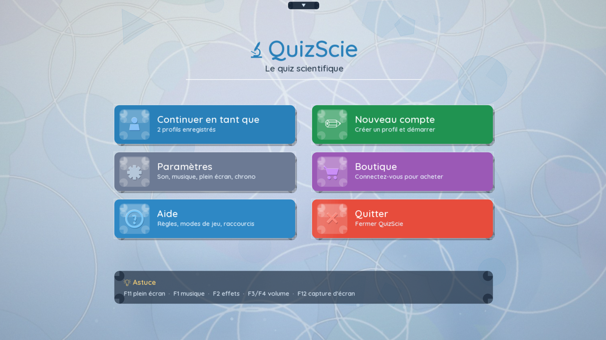

## 📸 Screenshots

<table>
  <tr>
    <td>
      <a href="assets/screen_0x1.png">
        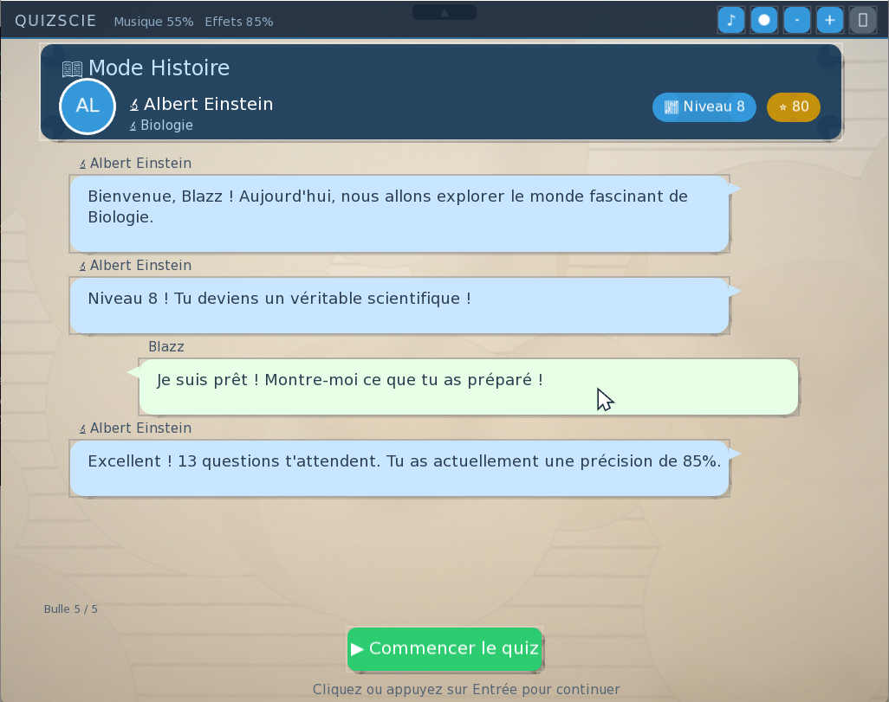
      </a>
    </td>
    <td>
      <a href="assets/screen_0x2.png">
        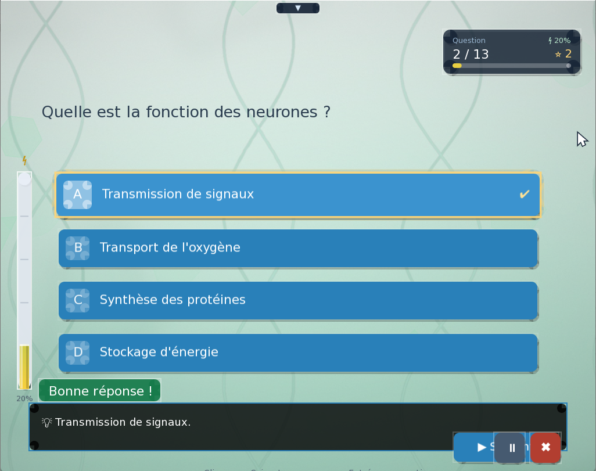
      </a>
    </td>
    <td>
      <a href="assets/screen_0x3.png">
        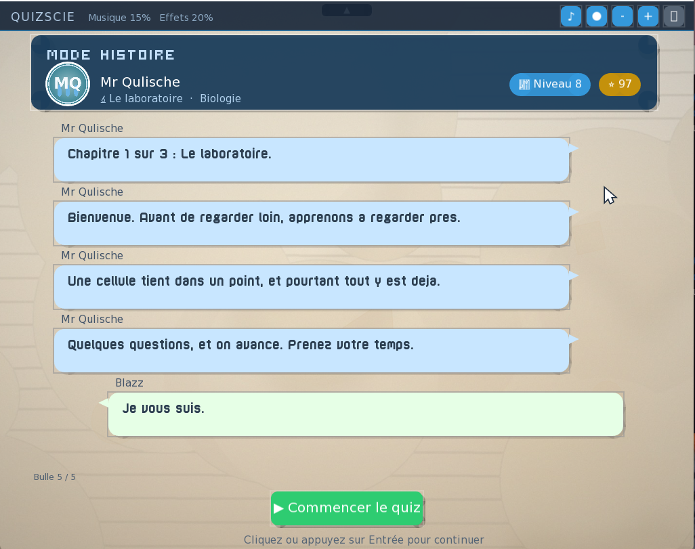
      </a>
    </td>
  </tr>

  <tr>
    <td>
      <a href="assets/screen_0x4.png">
        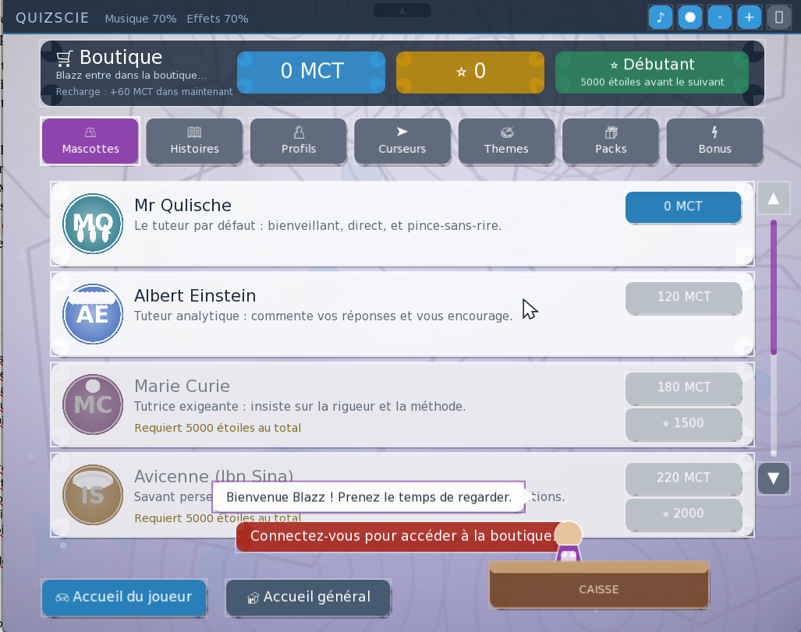
      </a>
    </td>
    <td>
      <a href="assets/screen_0x5.png">
        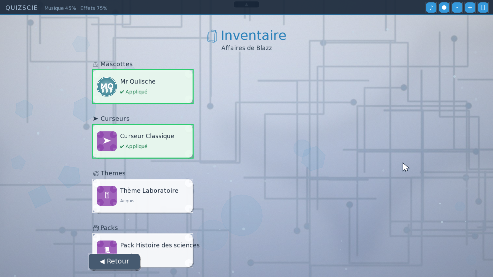
      </a>
    </td>
    <td>
      <a href="assets/screen_0x6.png">
        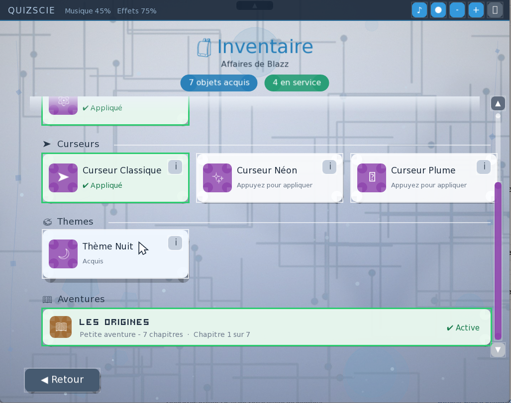
      </a>
    </td>
  </tr>

  <tr>
    <td>
      <a href="assets/screen_0x7.png">
        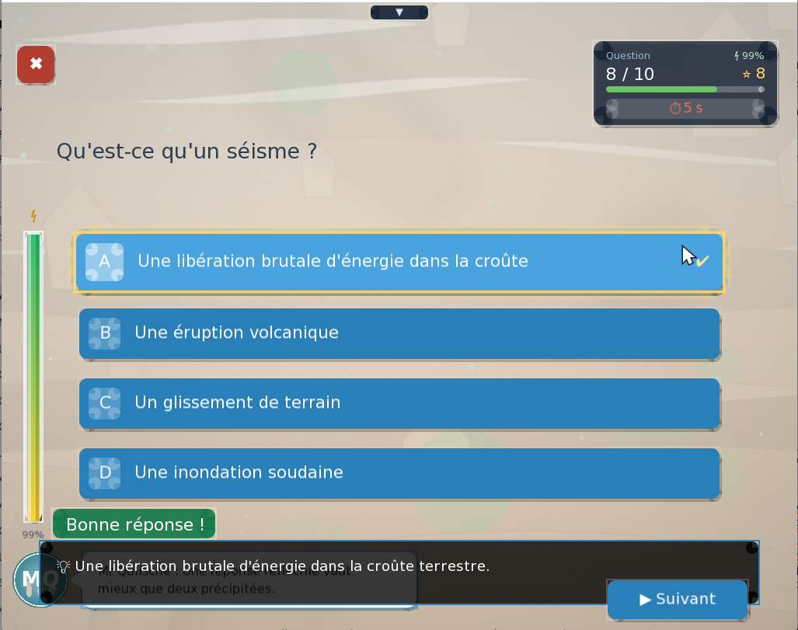
      </a>
    </td>
    <td>
      <a href="assets/screen_0x8.png">
        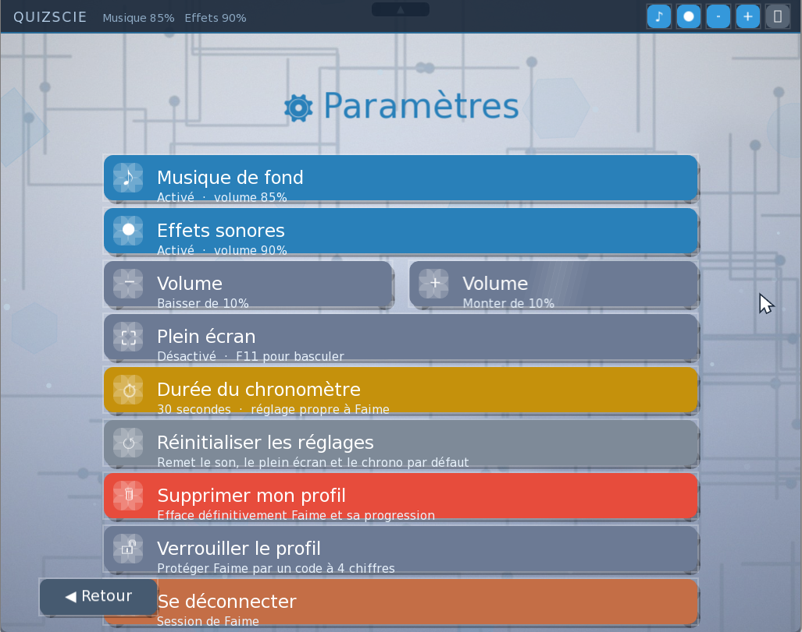
      </a>
    </td>
    <td>
      <a href="assets/screen_0x9.png">
        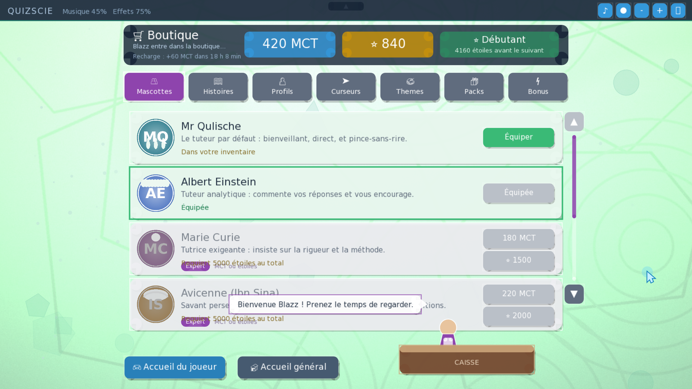
      </a>
    </td>
  </tr>

  <tr>
    <td>
      <a href="assets/screen_0x10.png">
        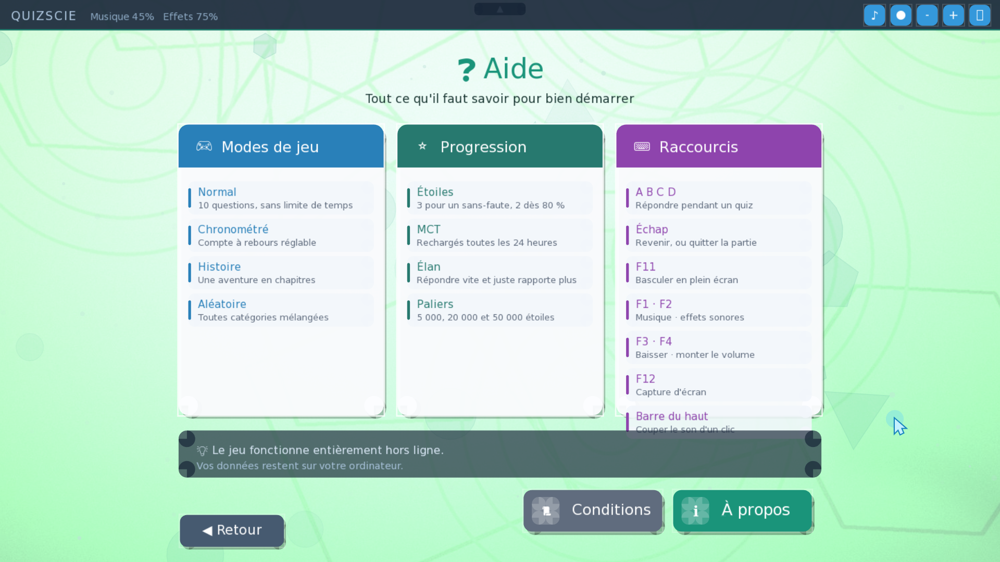
      </a>
    </td>
    <td>
      <a href="assets/screen_0x11.png">
        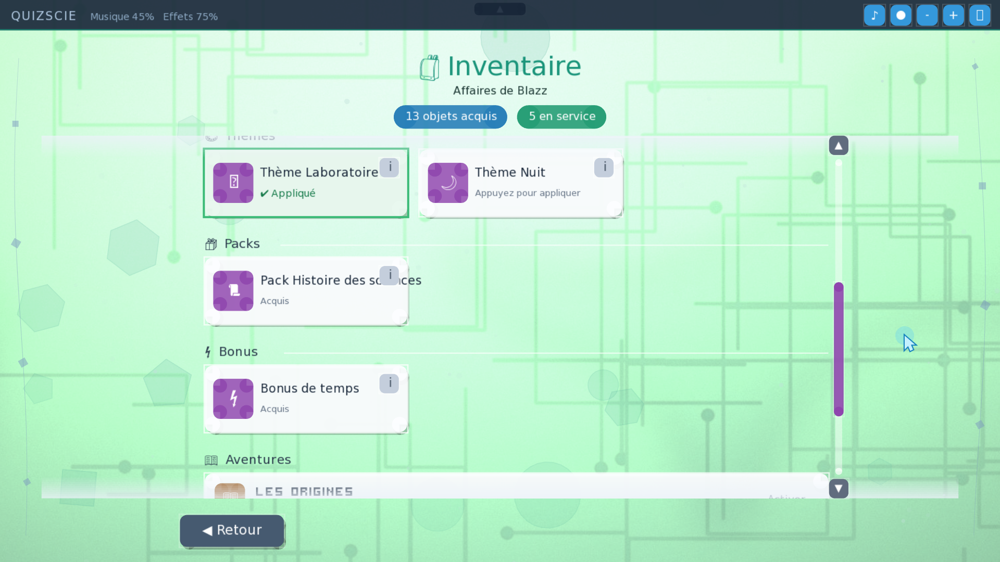
      </a>
    </td>
    <td>
      <a href="assets/screen_0x12.png">
        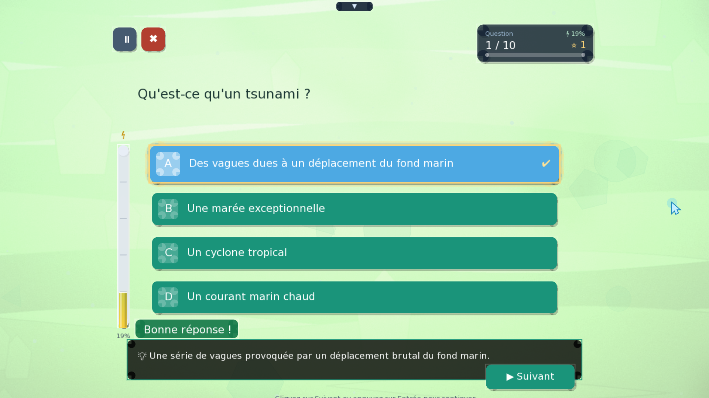
      </a>
    </td>
  </tr>

  <tr>
    <td>
      <a href="assets/screen_0x13.png">
        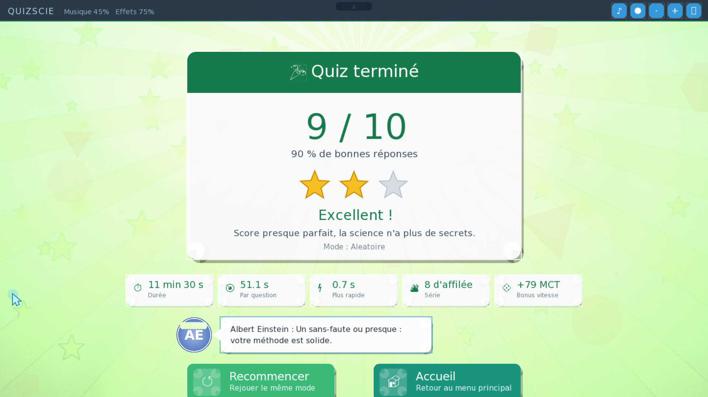
      </a>
    </td>
    <td></td>
    <td></td>
  </tr>
</table>

---

*Projet personnel de développement d'un jeu de quiz scientifique.*
